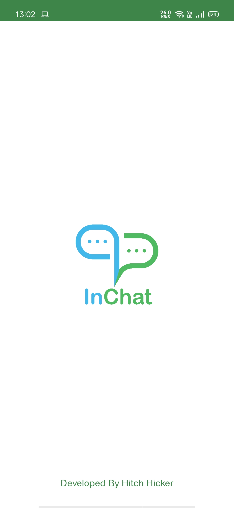
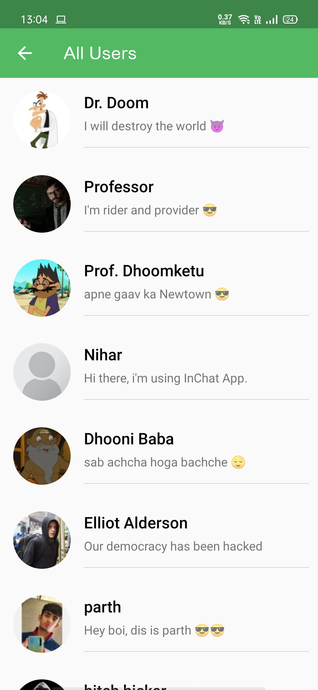

# InChat - Android APP - Chatting application

   

A project to predict housing prices from trained machine learning model. I've used [ridge regression algorithm](https://scikit-learn.org/stable/modules/generated/sklearn.linear_model.Ridge.html) to train the model.

## Tech Stack

- JAVA, Android-Studio

## Screenshot of the Web App

## Getting Started

- install inchat.apk in your android device

## Project Admin

 

|  |
| :----------------------------------------------------------: |
| **[Parth Panchal](https://www.linkedin.com/in/parthpanchal8401/)**  |

  
Personal Portfolio : [hitchhicker.tech](hitchhicker.tech) 

